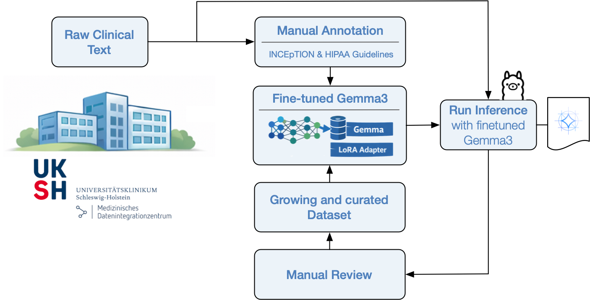

# LLM De-Identification Pipeline

A modular pipeline for **training and deploying LLMs (e.g. Gemma 3:27B)** for medical text de-identification.

This project is divided into two main components:

1. **Finetuning module** – streamlines training and customization of the LLM
2. **Runner / Listener module** – processes incoming data, performs de-identification, and returns results

---

## 🧠 Overview

The goal of this project is to enable **automated de-identification of sensitive medical text** using Large Language Models.

* Train or adapt a model (e.g. Gemma 3:27B)
* Deploy it behind a service
* Consume incoming data (e.g. via Kafka)
* Return de-identified outputs

---

## 🔄 Pipeline Overview



---

## 📁 Project Structure

```
llm-de-identification/
├── finetune/        # Model training and customization
├── runner/          # Listener + inference pipeline
└── logs/            # Runtime logs
```

---

## 🔧 1. Finetuning Module

Located in: `finetune/`

This module is responsible for:

* Training or adapting the model (e.g. Gemma 3:27B)
* Defining how data is loaded and preprocessed

### Key Files

* `finetune_gemma3_27b.py` – main training script
* `dataloader.py` – **customizable data loading logic (IMPORTANT - requires editing)**
* `Modelfile_gemma27b` – model configuration
* `USAGE.md` – additional usage instructions

### ⚠️ Important

The **`dataloader.py`** is the main extension point:

* Adapt it to your dataset format
* Control preprocessing and feature extraction

### ▶️ Running Training

Example (adapt as needed):

```bash
cd finetune
python finetune_gemma3_27b.py
```

---

## 🚀 2. Runner / Listener Module

Located in: `runner/`

This module:

* Listens for incoming data (e.g. Kafka)
* Sends requests to the running model
* Returns de-identified results

### Features

* Kafka-based ingestion (`kafka_consumer.py`)
* Prompt handling (`prompts.py`)
* Logging configuration
* Dockerized deployment

### Flow

1. Receive input data
2. Send request to model backend
3. Perform de-identification
4. Return processed result

---

## 🐳 Running the Runner (Docker)

Inside `runner/`:

```bash
docker build -t llm-runner .
docker run --env-file .env llm-runner
```

Or via entrypoint:

```bash
./entrypoint.sh
```

---

## ⚙️ Configuration

Environment variables are defined in:

```
runner/.env-template
```

Copy and adapt:

```bash
cp runner/.env-template runner/.env
```

---

## 🧪 Use Case

Designed for:

* Medical text processing
* Clinical document anonymization
* Research pipelines requiring GDPR-compliant data handling

---

## 🛠️ Tech Stack

* Python
* LLMs (Gemma 3:27B)
* Docker
* Kafka (for streaming ingestion)
* Custom prompt engineering

---

## 📌 Notes

* The project is modular → training and inference are decoupled
* Easy to adapt to new datasets via the dataloader
* Easy to adapt to new models
* Suitable for integration into larger data pipelines (e.g. NiFi)

---

## ⚠️ Disclaimer

This software is intended for research purposes only.
It does not guarantee full compliance with GDPR, HIPAA, or other data protection regulations.
Users are responsible for validating outputs before use in production.
---

## 📚 Citation

If you use this work, please cite:

```bibtex
@article{macedo2026llm_deidentification,
  title   = {LLM-Based De-Identification of German Clinical Free Text: Balancing Privacy Protection and Secondary Use},
  author = {Macedo, Mário and Kruse, Jesse and Händel, Claas and Saalfeld, Sylvia and Schreiweis, Björn and Ulrich, Hannes},
  year    = {2026},
  journal = {Preprint},
  institution = {Kiel University and University Hospital Schleswig-Holstein},
}
